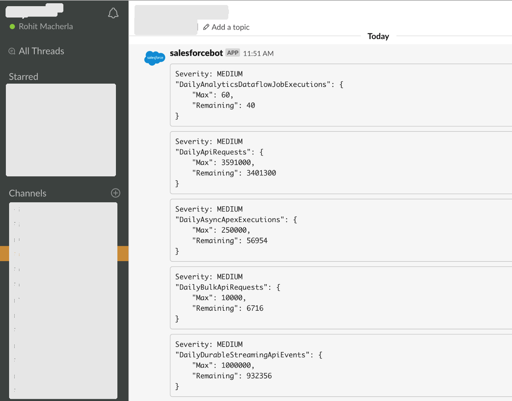

This is a post in a series about Monitoring.

- [A case for better monitoring](#a-case-for-better-monitoring)
- [Here's what we are going to achieve](#heres-what-we-are-going-to-achieve)
- [Let's do it](#lets-do-it)
  - [Fetching the limits](#fetching-thelimits)
    - [Evaluating if limits are over a threshold](#evaluating-if-limits-are-over-a-threshold)
  - [Sending an alert message to a Slack channel](#sending-an-alert-message-to-a-slackchannel)
- [Wrapping it up](#wrapping-itup)

### A case for better monitoring

Let's say we have a mechanism for storing errors as a custom object records in our implementation of Salesforce.com. If we want to track any production errors, we can send email alerts whenever an error record is created. It solves the purpose but surely there's better ways of going about it! Similarly, let's say we suddenly notice that our incoming Bulk API calls are no longer working because our source system tells us that they receive errors.

That doesn't sound so good, does it? Waiting for someone else to tell us that there's something wrong with our system does not build trust in our system. If we are able to find out such problems ourselves and solve them, and in the interim if our someone from the source system tells us that we are no longer accepting their API calls, it's much better to say "we are aware of it and are working to fix it", or perhaps even going further to let everyone know about it before they find it out. That builds so much more trust in our team and the technical leadership, and something we should vie for.

> When we are able to monitor something, we can be more proactive, as opposed to being reactive, in identifying and solving issues.

Salesforce.com provides a few mechanisms - the email alerts when API limits cross a certain %, email alerts for new records created, etc. but it's up to us to extend them further and build robust practices.

To this end, I started building simple integrations that help. [Slack](https://slack.com/) is slowly growing as the de facto standard for team communication. Teams constantly rely on Slack for build messages from their Jenkins jobs, GitHub PRs and JIRA integrations. Some have support channels in Slack specific to their teams, and it makes sense to have Salesforce.com alerts sent to such a Slack channel. If the people on support are members of that channel, they'll be notified when there are issues.

### Here's what we are going to achieve


_A Slack channel that shows Salesforce.com alerts: Governor Limits alerts in the picture_

To make it work, such an alerting mechanism must run frequently, and once per minute seems a good place to start. You may want to schedule it every 5 mins and it would certainly work well, but it's your monitoring use case that drives the frequency. For most systems, I presume once a minute is a good metric. Sounds like a good plan, at least so far on paper. Hence, I set out to create a simple Slack alerting mechanism from Salesforce.

I picked **Limits** as a good starting point for this project especially because I don't quite like emails as a standard alerting mechanism for API limits. Instead of dealing with just the API limits, I extended the scope to cover all the items supported by the Limits API.

All code for this [is in GitHub.](https://github.com/markgarg/salesforce-alerting)

## Let's do it

Broadly, the solution consists of:

1. Fetching the limits
2. Evaluating if limits are over a threshold; and
3. Sending an alert message to a Slack channel

#### Fetching the limits

Salesforce provides Limits resource that encapsulates some of the governor limits. It's available in two formats:

- Apex class :
  The [Limits class](https://developer.salesforce.com/docs/atlas.en-us.apexcode.meta/apexcode/apex_methods_system_limits.htm) has methods to list a lot of limits, but this isn't as extensive as the Metadata API. Perhaps Salesforce has plans to keep it in sync with Metadata API, but not yet at the time of writing this.
- Metadata API:  
  The Metadata API is a reliable way to fetch the limits, but each call to fetch the limits counts against the Governor limits.

I decided to use the Metadata API as it offers a lot more Limits to alert than the Apex class. Even if we schedule the alerting mechanism to run every minute, that'll be just 1440 API calls that are used in 24hrs which, in my opinion, is a very small price to pay for the benefits.

The `AlertManagerSchedulable` is the entry point for starting the process. When scheduled, this class will check if there are any alerts (by implementing the `shouldAlert` interface) and will then invoke them if there are any. The `shouldAlert` method in turn calls the metadata api to fetch the limits. It involves using a `NamedCredential`, a `ConnectedApp` for OAuth and an `AuthProvider` to achieve this. [Here's a good post](https://www.gscloudsolutions.com/blogpost/Using-Named-Credentials-with-the-Apex-Wrapper-Salesforce-Metadata-API-apex-mdapi?blogpost=true) to set it up.

##### Evaluating if limits are over a threshold

The Limits API response looks like this:

```js
{
    ...
    ...
    "DailyApiRequests": {
        "Max": 15000,
        "Remaining": 14998
    },
    "DailyAsyncApexExecutions": {
        "Max": 250000,
        "Remaining": 250000
    },
    "DailyBulkApiRequests": {
        "Max": 5000,
        "Remaining": 5000
    },
    ...
    ...
}
```

The code goes over all the items returned in the `Limits` API call and just compared the `Max` to `Remaining`. For simplicity, the first version of the code checks the usage against a hard-coded threshold value of 70% to issue an alert with a severity level of `MEDIUM`, and 90% to issue an alert with a severity level of `HIGH`.

Further versions can use this as a configurable setting in Custom Metadata Type and can go even further and specify different thresholds for different limits.

It then builds a message that needs to be alerted.

### Sending an alert message to a Slack channel

Turns out, that Slack has a very simple integration mechanism. An HTTP POST does the job!
The request body looks like:

```js
{
    "channel": "the slack channel where the message needs to be sent",
    "username": "the username to be displayed",
    "text": "the text to be displayed. This will be the one that shows up on the Slack channel",
    "icon_emoji": "the name of an emoji icon in your slack org"
}
```

We'd need a `WebHook` for it though, here's how to get it:

1. Login to the Slack account online via the browser
2. Navigate to Menu> Configure Apps> Incoming WebHooks> New Configuration
3. Enter channel name or create a new channel and click `Add Incoming WebHooks integration`

That's it, we'd be presented with a web hook url which needs to be copied into the Custom Metadata's `Alert URL`. There's also some friendly info and a curl that we can use to test it out as well. Here's a sample from Slack's documentation (after we've changed the channel name and web hook URL of course):

```bash
curl -X POST - data-urlencode "payload={\"channel\": \"#channel-name-here\", \"username\": \"webhookbot\", \"text\": \"This is posted to #channel-name-here and comes from a bot named webhookbot.\", \"icon_emoji\": \":ghost:\"}" https://hooks.slack.com/services/CHANGME
```

### Wrapping it up

When we deploy the code mentioned in [this GitHub repo](https://github.com/markgarg/salesforce-alerting) to our Salesforce instance, we are ready to roll. We need a Slack channel name, an icon emoji (which can be left to `:ghost`), the web hook URL and then configure the Custom Metadata Type `Config > Slack` with those values. When we schedule the alerting job, it'll make the API call to fetch limits, then compare it against the % threshold we've set and then send an API to Slack WebHook URL to create alerts!

_**P.S.** The code can be extended for other alerts and integrations_
