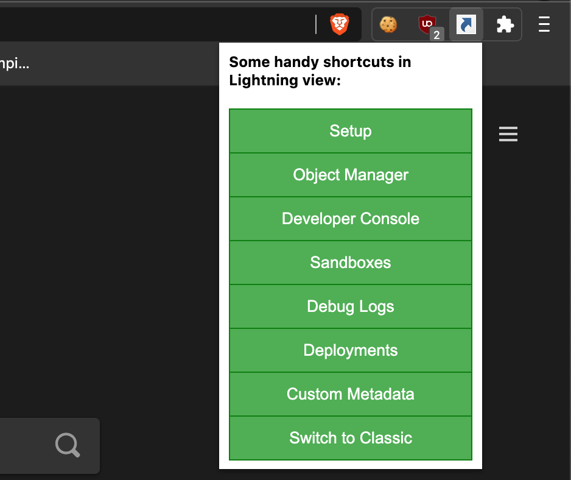

This post is about a Chrome browser extension that I've built to ease navigation in Salesforce Lightning UI. [It's available here](https://chrome.google.com/webstore/detail/salesforce-lightning-shor/affbbgonlcjjhjiefcjgkjikmgelmclp).

I find it time taking to sit around and wait for Salesforce Lightning UI to load for a lot of clicks that I need to open in a different browser tab.

For example, when I first login, there are lots of times I'd like to go to `Setup` first but not as many times that warrants setting it as the default landing page. Some other times, I'm debugging and I'd go to an Account and then open developer console and then start with it. Another a few times, there are specific areas that I'm after - Opening `custom setting`, or `Bot` or `Process Builder` or `Deployments` or... switch back to `Classic` where I can do things even faster.

In a lot of these scenarios, Salesforce Lightning behaves like an oxymoron and is utterly slow.

So, I built this small Chrome extension that just navigates to some of my most used shortcuts. I don't have to wait for the `Setup` link to load when I click on the cogwheel icon.

At the moment, it's just plain vanilla - has a few options that work - boom, that's it. I see adding at least one thing in the future:

- The ability to define one's own links without having to store it on the cloud. The idea is to have it in the local storage, with full privacy.

Until then, this one works for me. Hope it helps someone else too.

[Feel free to add more features or fork it yourself here](https://github.com/markgarg/sfdc-lightning-shortcuts-chrome-extn).

*This is how Salesforce Lightning Shortcut looks like*
