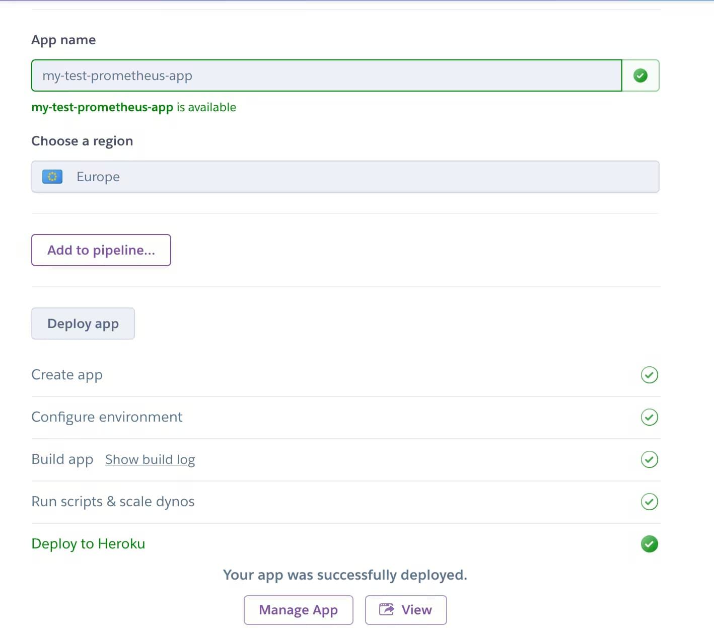
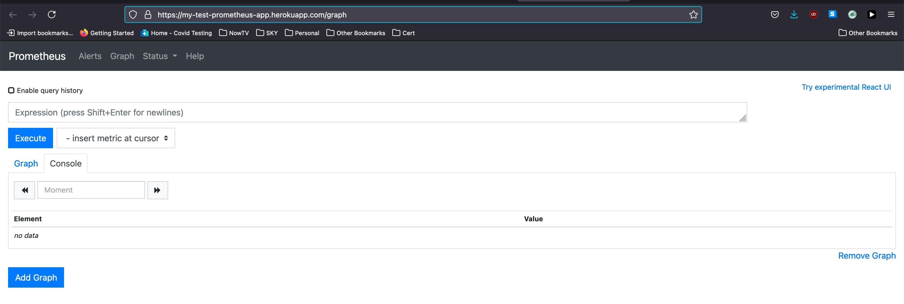

_This is a part of [series of blog posts about advanced monitoring techniques for your Salesforce.com application](/series-about-monitoring-your-salesforce-enterprise) so your business can rely on the tech team._

_So far, we've covered:_
1. _[A case for better monitoring](/a-case-for-better-monitoring)_
2. _[Slack alerts for Salesforce.com](/slack-alerts-for-salesforce)_
3. _[Taking it to the next level for monitoring the Salesforce.com Enterprise](/next-level-monitoring-for-your-salesforce-enterprise)_

Before we try to connect Salesforce.com and Prometheus, let's install it first. 

You could install it on your servers in your own data center by following the steps [here](https://prometheus.io/download/). There are also docker images and pre-compiled binaries to make the task easier.

However, for the purposes of this series, we are going to install it on [Heroku](https://heroku.com/). Heroku is a popular Platform-as-a-service that was acquired by Salesforce.com, and is easy to setup and quick to get your app running.

## Steps for installing Prometheus on Heroku

I've put together a small repository that installs Prometheus, as a [buildpack](https://devcenter.heroku.com/articles/buildpacks). Think of Buildpacks as applications that are bundled on top of Heroku.

I'm using the unofficial buildpack but with a configuration file and command to start the prometheus server.

All you have to do is:
1. Navigate to this sample GitHub repository: https://github.com/markgarg/sample-prometheus-on-heroku
2. Click on the `Deploy to Heroku` button.
3. Login to Heroku, if you haven't already.
4. Provide an app name and whether you'd want it on the US or Europe territory.
5. And choose `Deploy app`, that's it!

You can then get the git repository of the Heroku app and make any modifications you'd like to the configuration yourself!

Here's how it looked like when I did it in July 2021:
<picture>
  <source type="image/avif"
          srcset="./prometheus-installed-on-heroku.avif" />
  
</picture>

When you then navigate to the app itself, you can see it running Heroku like this:
<picture>
  <source type="image/avif"
          srcset="./running-prometheus-screenshot.avif" />
  
</picture>

We've now installed Prometheus monitoring and alerting toolkit on Heroku. 

That's it, folks!

Next:
- _[Prometheus metrics and API structure](/prometheus-metrics-and-api-structure)_
- _[Exposing a Salesforce API that Prometheus can call](/creating-salesforce-api-to-invoke-from-prometheus)_
- _[Wiring it up - Integrating Salesforce with Prometheus](integrating-salesforce-with-prometheus)_
- _[Alerts and wrapping up the series](monitoring-alerts-and-wrapping-the-series)_