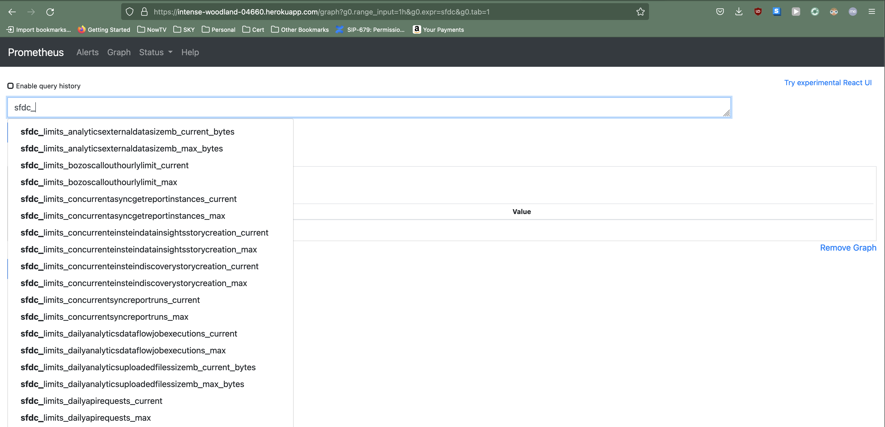
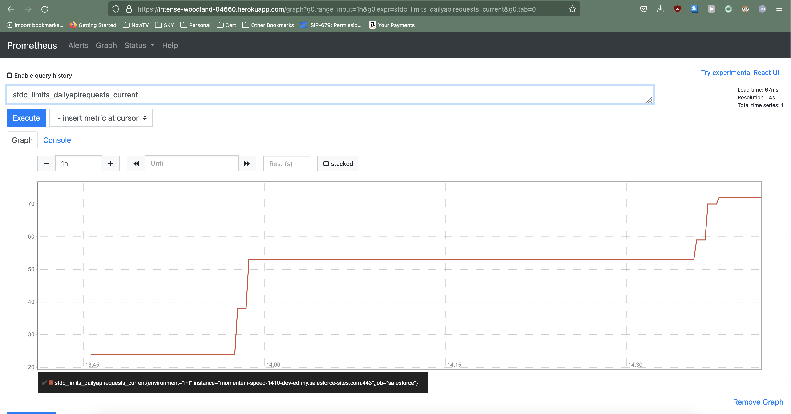

_This is a part of [series of blog posts about advanced monitoring techniques for your Salesforce.com application](/series-about-monitoring-your-salesforce-enterprise) so your business can rely on the tech team._

_So far, we've covered:_

1. _[A case for better monitoring](/a-case-for-better-monitoring)_
2. _[Slack alerts for Salesforce.com](/slack-alerts-for-salesforce)_
3. _[Taking it to the next level for monitoring the Salesforce.com Enterprise](/next-level-monitoring-for-your-salesforce-enterprise)_
4. _[Installing Prometheus on Heroku](/installing-prometheus-on-heroku)_
5. _[Prometheus metrics and API structure](/prometheus-metrics-and-api-structure)_
6. _[Exposing a Salesforce API that Prometheus can call](/creating-salesforce-api-to-invoke-from-prometheus)_

Back in [Chapter 4](/installing-prometheus-on-heroku), when we installed Prometheus on Heroku, we also setup a configuration file that it uses. It's the `prometheus.yml` file, which defines everything related to fetching data from other systems and recording and alerting rules to run. 

This is the place we are interested in now.

## Scrape Config

The main section of the config file is the `scrape_configs`. Each entry within this has information about server(s) to get metrics from. The act of getting this data is called `scraping`. 

As we already know the URLs of the Salesforce API where our metrics API is hosted, we can use the `static_config` section and specify the `targets`. We can also configure how frequently Prometheus should poll this server via the `scrape_interval` available to be configured globally and also can be overridden at each scrape config level.

There is also config available to specify what authentication mechanism should be used. It supports Basic Auth, OAuth 2, or you can even specify an Authorization header as well. For our example, we've already exposed a Salesforce API that is publicly visible on a Site URL. When you are building this for your platform, please consider a good auth mechanism.

The realtime info about all these targets is available at the `/targets` endpoint of your Prometheus system.

### Default Scrape Config

When we setup Prometheus, it comes with a default `scrape_configs` section that polls itself. That is, it's monitoring itself! Here's how it looks like:

```yml
scrape_configs:
  - job_name: 'prometheus'
    scrape_interval: 5s
    static_configs:
      - targets: ['localhost']
```

Quite simply, it's calling itself to get metrics about its own server, every 5 seconds.

## Adding Salesforce as a target

To add Salesforce as one of the servers to get metrics from, we need to create a `scrape_config` for it. Assuming that you've been following the tutorial, you'd have your Salesforce API setup from the [previous chapter](/creating-salesforce-api-to-invoke-from-prometheus) at `/services/apexrest/api/v1/prometheus`. Here's what we'll use for our example:

```yml
- job_name: 'salesforce'
    scrape_interval: 1m
    metrics_path: '/services/apexrest/api/v1/prometheus'
    scheme: https
    static_configs:
      - targets: ['<your site url here>']
```

Adding this to the existing Prometheus config file, the full file might look something like this:

```yml
global:
  scrape_interval: 10s

scrape_configs:
  - job_name: 'prometheus'
    scrape_interval: 5s
    static_configs:
      - targets: ['localhost']
  - job_name: 'salesforce'
    scrape_interval: 1m
    metrics_path: '/services/apexrest/api/v1/prometheus'
    scheme: https
    static_configs:
      - targets: ['<your site url here>']
```

We've now configured Prometheus to call the Salesforce API that we've setup, which returns metrics in the format that Prometheus expects, and this happens once every minute.

So, we are retrieving all the Salesforce Org Limits into Prometheus.

### Viewing the metrics in Prometheus

To confirm that we are getting these values, let us do a simple search on the Prometheus home page. I've deployed my app on Heroku following instructions from one of the previous chapters about [Installing Prometheus on Heroku](/installing-prometheus-on-heroku). We've prefixed each of these Limit metrics with an `sfdc_limits`, so a search on the home page brings them all out to us:
<picture>
  <source type="image/avif"
          srcset="./prometheus-home-showing-salesforce-metrics.avif" />
  
</picture>

Using a graph for `sfdc_limits_dailyapirequests_current`, we can see an increase in the number of daily API requests as I open my dev console and perform some SOQLs in there. 
<picture>
  <source type="image/avif"
          srcset="./prometheus-daily-api-limits.avif" />
  
</picture>

That's it! We've now integrated Prometheus with Salesforce and can collect and alert metrics.

Next:

- _Wrapping the series!_
